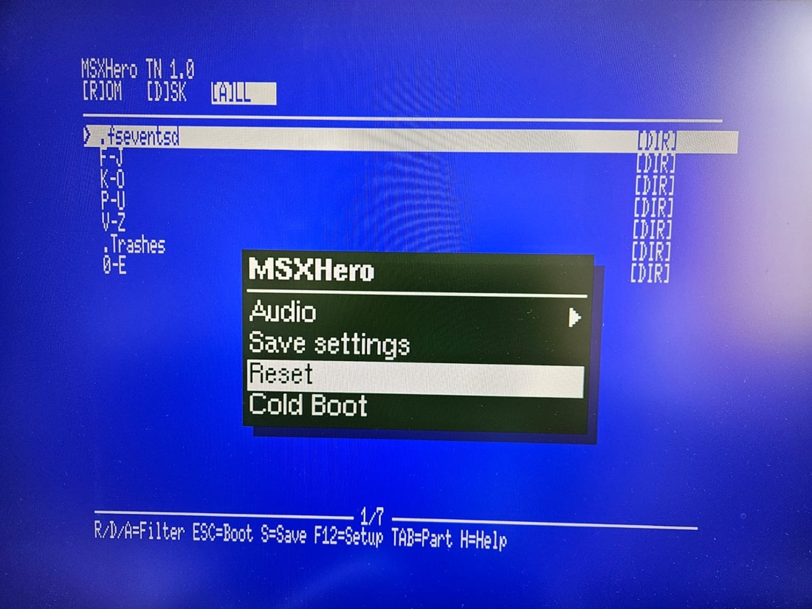
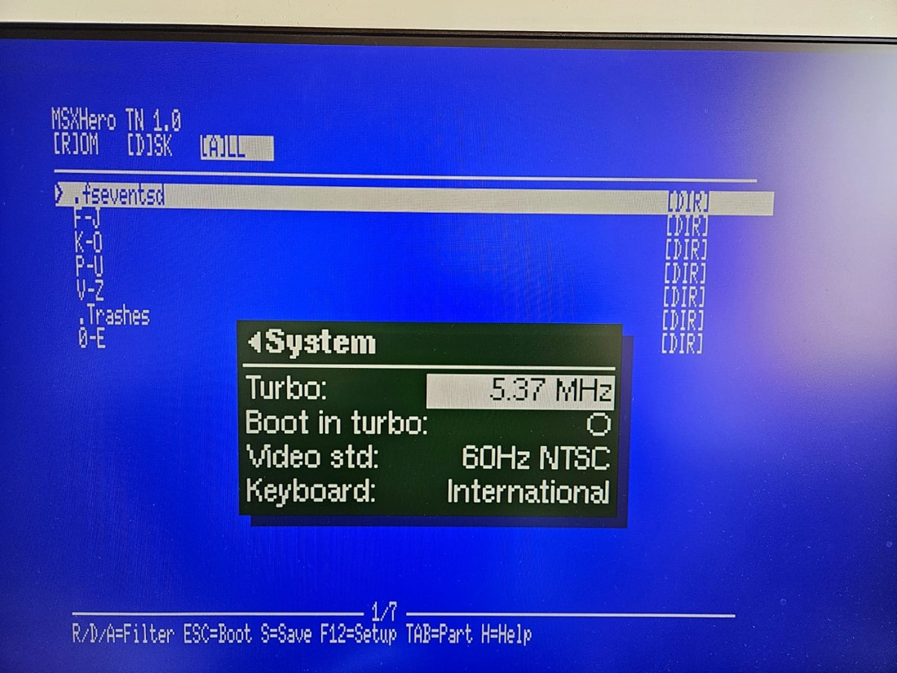
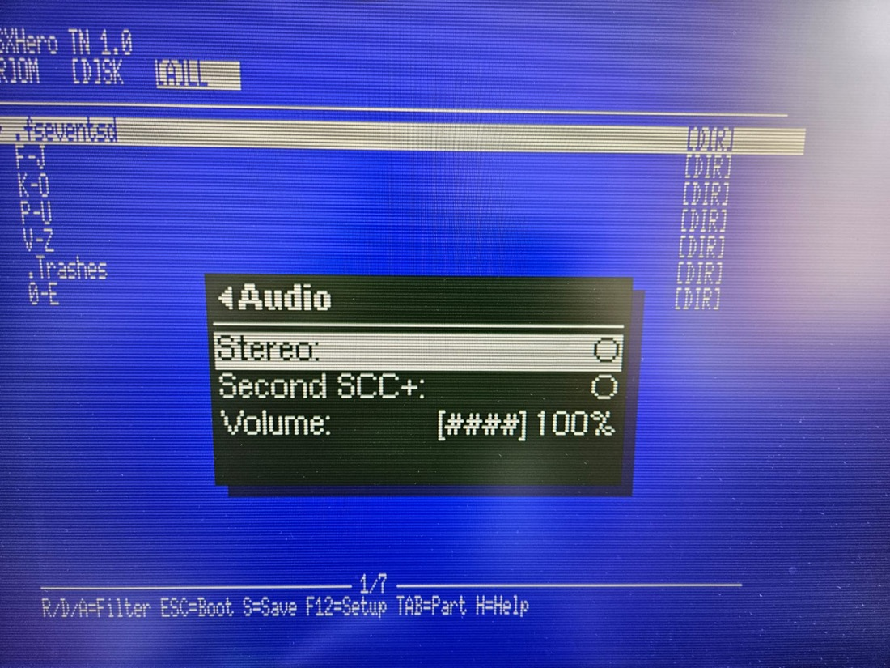
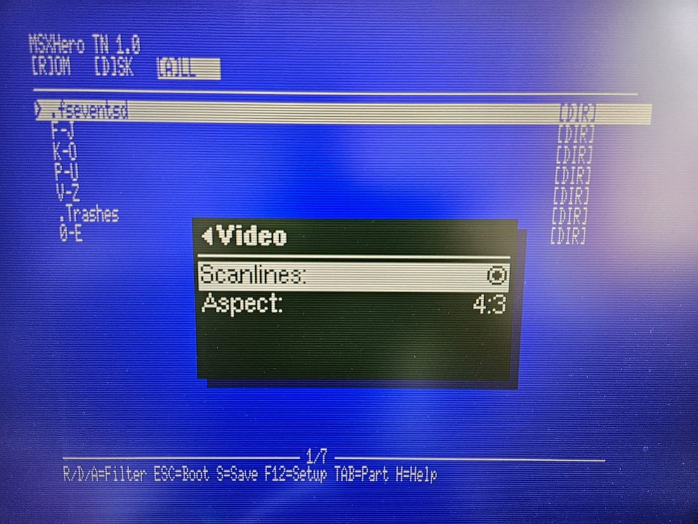
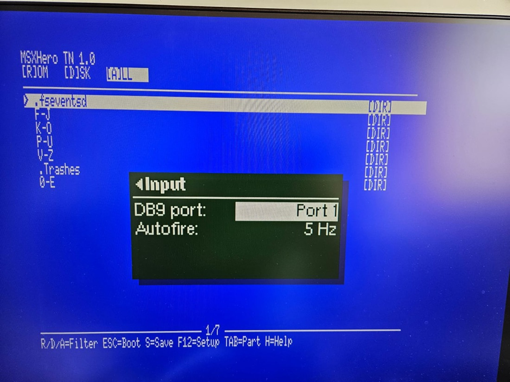

# MSXHeroTN

An MSX2+ core for the **Tang Nano 20K** running on the **MiSTeryShield20k RPi Pico USB** shield.

A fork of [Papipapito/MSXnano](https://github.com/Papipapito/MSXnano), retargeted from the
bare Tang Nano to the MiSTle shield so that the shield's own hardware — its DB9 joystick
port and MIDI sockets — actually works, instead of sitting unconnected.

---

## Status: working, with one feature outstanding

**It runs on real hardware.** The core synthesizes, boots to the file browser, loads and
plays games, takes a DB9 joystick, and brings up the FPGA-Companion OSD on F12 with working
video, audio and turbo settings. Settings persistence is written but not yet built or tested.

| | State |
|---|---|
| Synthesizes on Gowin EDA | yes |
| Boots, browser, loads and runs ROMs | yes |
| **DB9 joystick** on the shield | **yes** — all directions and both fire buttons |
| BIOS pack, SD browsing, Nextor | yes |
| **OSD overlay (F12)** | **yes** — centred, named MSXHero, settings reach the core |
| **Turbo** | works from the OSD; applied via reset. F11 no longer intercepted, and the crash is gone with it |
| Video and audio settings from the OSD | scanlines, aspect, stereo, second SCC+, volume |
| **Saving settings** | **yes** — into the FPGA's flash. Not yet verified on hardware |
| Boot menu | English, titled MSXHero TN 1.0 |
| **OSD Reset / Cold Boot** | **yes** — verified on hardware |
| Boot logo | own logo works; the v1.9 pack ships the slot blank |
| On-board BL616 HID | removed by design — HID comes from the shield's Pico |
| ESP-01S WiFi, WS2812 LED | given up: their pins are the DB9 lines |

A prebuilt bitstream is in [`compiled/`](compiled/).

**If a build ever leaves you with a broken machine**, the last one verified on hardware is
kept separately in [`compiled/known-good/`](compiled/known-good/) where no later build can
overwrite it, and its source is tagged `known-good-6389ac0`. Flashing that file is enough to
get back to a working MSX; see the README in that folder.

### Branches

`main` only moves when a build has been **verified on hardware**, not merely when one closes
timing. Work in progress lives on **`dev`**, and that is the branch the build machine
compiles. If you want the version that is known to run, you are on the right branch.

**Timing closes.** `clock_54m` meets its 54.000 MHz constraint at **55.626 MHz with zero
negative slack on every domain**, at 87% CLS. It had been missing for several builds — at
worst 50.4 MHz — until the CPU read mux was restructured as a tree; there is now more margin
than any earlier build had. [docs/UTILISATION.md](docs/UTILISATION.md) records how that was
chased and, more usefully, what did not work.

### Known issues

**The OSD shows defaults after a power cycle, even when saved settings are in use.**
sysctrl's CMD 4 is one-way, companion to core, so the core has no way to tell the OSD what it
restored from flash. Set the volume to 50%, save, power cycle: the machine plays at 50% and
the menu says 100% until you touch that entry. Cosmetic, but it looks like a bug.

Fixing it properly means letting the *companion* own the settings file, which is how
MiSTeryNano does it — see [Saving settings](#saving-settings) below.

**Video std and Keyboard in the OSD are decoded but not acted on.** `system_pal` and
`system_keyboard` arrive from the companion and go nowhere. The machine's video standard
still comes from the boot menu.

**Turbo is applied by resetting into the new speed**, not switched live — changing CPU
cadence while running hangs the machine. The F11 shortcut is gone: keys belong to the MSX,
machine settings belong in the overlay.

---

## Flashing notes learned the hard way

**Take the Tang out of the shield to flash it.** With the shield attached, the FTDI device
enumerates but JTAG fails with `ftdi_usb_reset failed (-6)`. FPGA-Companion can drive JTAG
itself (`jtag.c`, `gowin.c`) and the shield also wires `RECONFIGN`, so something on the shield
contends for those lines. Out of the shield it works every time.

**Do not flash FPGA-Companion firmware onto the Tang's on-board BL616.** Doing so replaces the
factory debugger — the FTDI-compatible `20K's FRIEND` — and openFPGALoader then has nothing to
talk to, on any host. Restore it by flashing
[`friend_20k_encrypted_bl616.bin`](https://github.com/MiSTle-Dev/FPGA-Companion/tree/main/src/bl616/friend_20k)
at `0x0` (the encrypted variant, for fused `3923` boards). This costs nothing here, because
this fork does not use the on-board BL616 at all.

---

## What it looks like

The boot menu is an SD file browser that runs before the OS. `F12` opens the FPGA-Companion
overlay on top of whatever is running, so machine settings are reachable from a game as well
as from the browser.



*The overlay over the browser. `MSXHero TN 1.0` and the key legend belong to the boot menu,
which is board-specific; the overlay is named plain `MSXHero` because the same menu definition
is meant to serve the ECP5 build too. Reset and Cold Boot work because `fpga_companion` is
reset from PLL lock rather than from the core reset — see [docs/FINDINGS.md](docs/FINDINGS.md).*



*Turbo switches the CPU to 5.37 MHz by resetting into it; changing cadence while running
hangs the machine. Video std and Keyboard are decoded but not yet acted on.*



*Volume is drawn as an ASCII bar in the entry labels — FPGA-Companion renders `<range>` as a
plain number and has no bar widget, and a drawn one would mean forking its firmware.
Attenuation is an arithmetic shift on a signed sample; a logical shift here turns the
negative half of the waveform into loud distortion.*



*Scanlines and aspect write the same config registers the on-MSX `S` screen uses, on change,
so whichever was touched last wins and both menus keep working. Aspect only sets the HDMI AVI
InfoFrame — the display decides whether to pillarbox or stretch, and many ignore it.*



*The shield's DB9 joystick, and which MSX port it answers on. It is mixed into the same PSG
lines as the USB gamepad, so either can drive a game. The Autofire entry visible here has
since been removed — the rate is fixed in the core, and making it selectable would not close
timing.*


---

## Why this fork exists

Upstream MSXnano targets a bare Tang Nano 20K and drives its USB keyboard through the
board's **on-board BL616** microcontroller. That works, but the Tang Nano 20K has a single
USB-C connector and no USB-A, so the one port has to carry power and the keyboard at once.
In practice that means an **OTG adapter and a powered USB hub**, with the hub backfeeding
power to the board.

Which is the point worth making: **that arrangement is not free either.** A powered hub plus
an OTG adapter costs real money, takes two mains outlets between the board and the hub, and
leaves a tangle of adapters on the desk. Against that, the MiSTeryShield20k is not the
expensive option it first appears — it is roughly the same outlay for a tidier machine, and
you get more for it.

The shield solves the problem in hardware: it carries its own **RP2040 companion with a
proper USB host port**, so the keyboard plugs straight in and the Tang's USB-C is left doing
nothing but power. No hub, no OTG adapter, no backfeeding. It also brings a **DB9 joystick
port** and **MIDI in and out** — connectors upstream constrains **no pins** for, so on that
shield they sit inert.

This fork assumes the shield is present and wires the shield's hardware into the core.

---

## Target hardware

| Part | Notes |
|---|---|
| Sipeed Tang Nano 20K | Gowin GW2AR-18. Developed against a board silkscreened `3923` |
| MiSTeryShield20k RPi Pico USB | Provides the RP2040 companion, USB host, DB9 and MIDI |
| Raspberry Pi Pico | Runs [FPGA-Companion](https://github.com/MiSTle-Dev/FPGA-Companion) as the HID host |
| microSD card | FAT16 or FAT32, holding `.rom` and `.dsk` files |
| HDMI display | Video and audio |

The RP2040 talks to the FPGA over the five `m0s[]` SPI lines. The core switches to it
automatically when CS pulls `m0s[2]` low.

---

## What is different from upstream

### The on-board BL616 path is gone

The shield always brings its own RP2040 companion, so the on-board BL616 SPI link is
unusable here regardless of pins — `spi_dir` is dropped along with the rest of it.

*(An earlier version of this section claimed pin 75 carried the shield's DB9 fire-2 line and
that this forced the change. That was wrong, and it came from the same mis-reading that first
put the joystick on the wrong pins: `P75` is one of six lines on **J3, an expansion header**,
not on the DE9. Pin 75 is free. The BL616 path is still gone, just not for that reason.)*

Consequences, and they are real:

- **This core will not take a USB keyboard from the Tang's own USB-C connector.** HID comes
  from the RP2040 on the shield, or not at all.
- Flashing `fpga_partner` / `fpga_companion` firmware to the Tang's on-board BL616 does
  nothing useful for this core. That whole step is removed from the instructions below.
- On a bare Tang Nano 20K without the shield, this core will boot and show a picture but
  will have **no keyboard**, and is therefore not much use.

If you want the on-board BL616 back, use upstream.

### DB9 joystick — working

The shield's DE9 port is read directly by the FPGA and mixed into PSG port 0 alongside the
USB gamepad, so either input can drive the game.

| `db9[]` | Tang pin | Signal |
|---|---|---|
| 0 | 27 | Fire 1  TrigA |
| 1 | 28 | Down |
| 2 | 25 | Up |
| 3 | 26 | Right |
| 4 | 29 | Left |
| 5 | 30 | Fire 2  TrigB |

These are NanoMig's `js0[]` — its "generic IO pins used for DB9 port 1" — confirmed against
this shield's own PCB netlist, where the joystick nets land on **J4 pads 8–13** and pad 14
carries `P31`, anchoring that run of the header to FPGA pins 25–31.

### What this costs

Three of those pins were in use, so this build gives up:

- **The WS2812 case LED** (pin 25) — an *external* addressable LED strip for the 3D-printed
  case, not anything on the Tang itself. Nothing is lost unless you built that case with a
  strip fitted.
- **The ESP-01S WiFi UART** (pins 27/28) — so WiFi over an ESP-01S module is not available on
  this build. The UNAPI ROM is still in the BIOS pack and `wifi_lite` still elaborates; it
  simply has no pins. Reaching WiFi another way is plan item 9.

Both ports are removed from `top.v` and kept as internal wires, so the modules driving them
still elaborate and synthesis prunes them. Leaving them as unconstrained ports would be worse
— Gowin would auto-place them, possibly onto pins that matter.

The lines are active low — a switch to ground, with internal pull-ups — which is already
what MSX PSG Port A expects, so they AND straight into the existing joystick path with no
level conversion. The shield level-shifts them through six `2N7002` FETs in the usual
bidirectional (non-inverting) arrangement, so the polarity survives to the FPGA.


The decode follows NanoMig's `db9_joy0` exactly —
`{!js0[5],!js0[0],!js0[2],!js0[1],!js0[4],!js0[3]}`, i.e. Fire2=`js0[5]`, Fire1=`js0[0]`,
Up=`js0[2]`, Down=`js0[1]`, Left=`js0[4]`, Right=`js0[3]` — since NanoMig demonstrably works
on this shield.

### Companion OSD overlay — working

Upstream decoded the OSD SPI channel and discarded the data. This fork renders it: the
128×64 monochrome framebuffer the companion sends is composited onto the picture inside
`v9958_top`, between the VDP's RGB and the HDMI encoder.

The menu itself is served from the core — `sysctrl` CMD 8 streams a gzipped
[`msxnano.xml`](fpga/src/usb/msxnano.xml) out of a 1 KB ROM in the bitstream, so the menu
cannot drift out of step with the core it configures. Regenerate it with
`fpga/src/usb/make_menu_rom.sh` after editing the XML. CMD 4 decodes the ids the menu sets.

`osd_u8g2.v` is vendored unchanged from MiSTeryNano (GPLv3), which is the reference
implementation of this protocol.

The menu is titled **MSXHero**, with no board suffix, because the same definition is intended
to serve the ECP5 build as well as this one. It carries System (turbo, boot turbo, video
standard, keyboard layout), Input (DB9 port, autofire), Video (scanlines, aspect), Audio
(stereo, second SCC+, volume), and Reset and Cold Boot at the bottom. Board-specific naming
lives in the boot menu instead, which titles itself `MSXHero TN 1.0`.

It is centred using offsets derived from the **VDP's** timing rather than the HDMI encoder's —
the OSD measures `VideoHS_n`, which the VDP generates, and the two have separate counters.
Getting that wrong left the overlay about 100 px right of centre.

Reset works because `fpga_companion` is reset from **PLL lock**, not from the core reset. That
detail is essential: `sysctrl` holds the OSD's values, so resetting it from the net it drives
makes an OSD reset impossible. See [docs/FINDINGS.md](docs/FINDINGS.md).

**Volume** shows an ASCII bar built out of the entry labels (`[####] 100%`), because
FPGA-Companion renders `<range>` as a number and has no bar widget. A *drawn* bar is possible
but needs a font swap and a firmware rebuild — see
[`pf2bdf.py`](fpga/src/usb/pf2bdf.py), which converts MiSTer `.pf` fonts to BDF for `bdfconv`.
Those fonts are fixed 8×8, which matches the OSD's native 16×8 character grid, and they carry
a solid block at ASCII `0x7F` — a single byte, legal in XML, so it needs no UTF-8 handling.
No font is committed here: Fonts_MiSTer has no licence and its files are traced from arcade
character ROMs, so supply your own as with the BIOS pack. It is implemented
as a shift attenuator on the mixer output, which is exact because the mix is 0-based unsigned
(silence is 0, not mid-scale), so attenuating cannot shift a DC offset and click.

**DB9 port** selects whether the shield's stick answers on MSX joystick port 1 or 2, by
swapping the two ports — games differ on which they read.

Wired so far: **volume** and **DB9 port**. The rest — turbo, boot turbo, scanlines, aspect,
stereo, second SCC+, video standard, keyboard layout, autofire rate — are decoded and
available in `top.v` but not yet merged with `config1_ff`/`config2_ff`, which the `S` menu
drives through I/O ports. Those two were done first because they touch only the audio mixer
and the joystick mux, not the boot config path.

---

### Saving settings

Written, not yet built or tested on hardware.

Settings go into the **FPGA's flash**, not onto the SD card. There has been a six-byte block
at `0x280000` since upstream — `'A'`, `'B'`, `config1`, `config2`, boot-turbo, and a sixth
byte written as `0xFF` and never read. The on-MSX `S` menu's Save has always used it. The
sixth byte is now ours:

```
[7] 0 = written by us   [6] spare   [5:4] autofire   [3] DB9 port   [2:0] volume
```

Bit 7 clear is the marker, so a board that has never saved reads `0xFF`, fails the test and
falls back to defaults. At `config_init` the block is read back and the values seeded; from
then on they follow the OSD.

That "follow the OSD" part is change-triggered rather than continuous, and the reason matters.
At start-up the companion pushes every value from the XML. If the core simply took whatever
the companion last said, those defaults would immediately overwrite what was just restored
from flash. Because the core only reacts to a value *changing*, and the XML defaults are
identical to `sys_ctrl.v`'s reset values, start-up produces no change and the saved settings
survive. **Keep those two sets of defaults in step or saving silently stops working.**

Save is triggered by a new sysctrl id `W`, raised and dropped by the OSD's `save` action the
way `R` is for reset. The core edge-detects it and pulses the same `config_flash_write_ff`
the MSX sets through port `&H42` bit 6. No reset is requested — the old menu offered Save &
Exit as well as Save & Reset, and this is the former.

Saving *during a game* is new; the `S` menu could only do it from the browser. It is safe:
the flash state machine parks in `STATE_IDLE` after boot and never reads again, and
`warm_reset_pending` drops the CPU to 3.58 MHz for the duration of the write and restores it
afterwards, at a clean cadence boundary. Expect a brief hiccup, not a crash.

**Why not a file on the SD card**, which is what `<save file="msxhero.ini"/>` in the XML was
attempting: nothing in the FPGA understands FAT. `sd_reader.sv` can already write a sector —
that part was never missing — but turning a filename into a sector number is filesystem work.
MiSTeryNano solves it by making the companion the filesystem owner: FatFS runs on the MCU and
the FPGA is a block device beneath it, via `sd_card.v`'s CMD 3 / CMD 5. Its core has no
filesystem at all and asks for sectors *within a mounted image*, which the MCU translates.

Ours has two filesystem owners already — Nextor and the Z80 boot menu — so adopting that
design here means a second master on the SD path plus a lock against Nextor, and a mistake
corrupts the card rather than a setting. At 87% CLS the timing risk is real too. The flash
route costs almost nothing and touches none of that. The companion route is the better
long-term answer, and the sensible place to prove it is the ECP5 build, which has room; the
OSD is shared between the two, so it would come back here once it works.

**Also fixed here:** the OSD's **Boot in turbo** entry did nothing at all — `system_turbo_boot`
was declared and wired to sysctrl but read by nobody. It is connected now.

**Autofire is parked, and the menu entry has been removed rather than left decorative.**
`system_autofire` had the same problem, but making the rate selectable cost `clock_54m` its
timing twice over. First as a 23-bit limit register and a variable comparator (`0b3f629`:
−0.555 ns across 6 endpoints). Then as a comparator-free free-running counter with the rates
a power of two apart, which is genuinely less logic and **came in under the CLS target at
9028** — and made timing dramatically worse anyway: 50.7 MHz, −5.172 ns across 17 endpoints,
with a second failing family appearing at the CPU/SDRAM boundary that had not been there.

That is the clearest evidence yet that **this design's timing is governed by placement, not
by resource count** — you can hand the placer a smaller netlist and get a worse result. It is
why the rule is to judge a feature by what it adds to `cpu_din`, and why anything touching
`clk_54m` is now treated as expensive regardless of size. Autofire still runs at a fixed
~10 Hz, exactly as it did before any of this.


## Plan

Split into two phases. **Phase 1 is getting a working port** — build what is already written,
prove it on hardware, and do only the easy things that make it pleasant to use. **Phase 2 is
everything else.** Nothing from Phase 2 starts before Phase 1 boots.

### Phase 1 — a working port

| # | Item | State |
|---|---|---|
| 1 | Synthesize on Gowin EDA | done |
| 2 | DB9 joystick | done, verified on hardware |
| 3 | OSD overlay on F12 | done, verified on hardware |
| 4 | Wire the OSD settings to the core | done for reset, turbo, volume, scanlines, aspect, stereo, second SCC+, DB9 port |
| 5 | Persist settings (Save) | **the one outstanding item** — needs the FPGA's SD target so the companion can reach the card |
| 6 | Translate the on-screen menu to English | done, and renamed MSXHero TN 1.0 |
| 7 | Own boot logo | tooling done; the v1.9 pack ships the slot blank |
| 8 | Fix the 115-file browser limit | not started |

### Phase 2 — the extras

**Which board gets what.** There are two MSXHero machines now — this one and
[MSXHero](https://github.com/terracide303/MSXHero) on the ECP5-45F — and they share the F12
OSD. They do not share headroom: this core is at 87% CLS with `clock_54m` closing at 55.626
against 54.000, while the ECP5 has room. So anything expensive is proven on the ECP5 first
and ported back if it fits, and where a feature splits, the Tang takes the cheap half rather
than waiting for the whole thing. MIDI is the first case: the ports here, the synth there.

Note that "87% full" is not the same as "nothing more fits" — there are about 1300 CLS free,
and size predicts very little. Deleting 693 lines of WiFi freed 24 CLS; restructuring one
read mux freed 127. What actually costs here is **adding another leg to the `cpu_din` read
mux**, which is the structure that had to be rebuilt to close timing. Judge a feature by how
many things the Z80 can newly read from, not by its size.


| Item | Size | Notes |
|---|---|---|
| **MIDI ports, as the SFG-05's UART half** | small | Two registers, a 31250-baud UART on pins 71/72, OPM decoded but stubbed. Drives external gear |
| **The SFG-05's FM synth (JT51)** | large | **On the ECP5, not here** — an 8-channel 4-op synth does not belong on a device at 87% |
| **USB mouse** | small | `hid.v` already has it; `fpga_companion.v` has the line commented out |
| **`.CAS` cassette** | medium | `MSX1_MiSTer/rtl/tape.sv` is reusable (GPL v2+) |
| **Persist SRAM saves** | medium | Fix `flash_rw.v`'s `write_terminate` first |
| **WiFi without the ESP-01S** | research | Depends on `at_wifi.c`'s AT dialect and whether the Pico is a W |
| **Drawn OSD bar + 8×8 font** | small, parked | Costs a companion firmware fork |
| **Backports from MSXimus** | small–medium | Audio remaster, 2 MB ASCII16, master volume, CRT borders |
| **Configurable mapper engine** | large | Carnivore2+'s register-driven approach, arrived at independently |
| **Swap to an MIT V9958** | medium | Resolves the GPL-3.0 licence inconsistency; source is HRA!'s FPGA_MSXtR |
| **Translate the Spanish comments** | large | 13 files; conflicts with rebasing onto upstream |
| **Housekeeping** | small | Release pins 13/48/76/86, keep rebased on upstream |

Detail for every item is in **[docs/ROADMAP.md](docs/ROADMAP.md)**.

---

## Building

Building the bitstream requires the **Gowin EDA IDE**, which has Windows and Linux builds
only — there is no macOS version. `openFPGALoader` can flash a finished bitstream from a Mac,
but it cannot synthesize one.

```
fpga/Z80_goauld.gprj    Gowin project
fpga/tang9k.cst         pin constraints
fpga/top.v              top level
```

---

## Flashing

Once a bitstream exists, two images go into the Tang's flash. `openFPGALoader` handles both
and runs on Linux, Windows and macOS.

```sh
# core bitstream
openFPGALoader -b tangnano20k -f msxnano.fs

# BIOS pack (MSX2+ BIOS, sub-ROM, Nextor 2.1.4, WiFi ROM)
openFPGALoader -b tangnano20k --external-flash -o 0x200000 --file-type raw goauld_rom_int.bin
```

The Pico on the shield takes stock FPGA-Companion firmware — hold BOOTSEL, plug it into a
computer, and drop `fpga_companion.uf2` (the `BOARD=PICO` build) onto the `RPI-RP2` volume.
No firmware goes to the Tang's on-board BL616.

---

## Using it

Files go in the root of the SD card, or in subdirectories.

| Extension | Loaded as |
|---|---|
| `.rom` | cartridge, into the megaram, with mapper auto-detection |
| `.dsk` | disk image, through Nextor disk emulation |

A cartridge lands in the megaram in slot 3-3, which is why a MIDI or FM cartridge would have
to share the machine with it — the layout the core presents to the MSX is:


**Only those two.** Upstream v1.9 removed ColecoVision and Sega SG-1000 support — the RTL,
the SN76489 core and the menu's `.COL`/`.SG` handling all went — so this fork does not have
them either. If you want them back, see the note below.

The boot menu matches the three extension bytes literally, so a `.mx2` file — a common format
for MSX2 cartridge dumps, and byte-identical to a `.rom` — is **invisible** until renamed.

The file browser starts before the OS. Arrows and RETURN navigate and launch, BS goes back,
`R`/`D`/`A` filter by type, TAB switches partition, `H` opens help, and ESC boots straight to
Nextor/MSX-DOS. **`F12` opens the OSD** for machine settings; `S` keeps a reduced on-MSX
screen whose only unique job is saving settings to flash, since the OSD's own Save cannot
reach the SD card. The WiFi entry is gone — WiFi is compiled out on this fork. Turbo is set from the OSD, not a keyboard shortcut; F12 is consumed by the companion
firmware and never reaches the MSX.

---

## Inherited from upstream

Everything not listed above comes from MSXnano unchanged: the Z80, the V9958 VDP with HDMI
output, dual PSG, SCC and SCC+ with an optional second SCC+, OPLL, SD card with Nextor 2.1.4,
the ESP-01S WiFi option, and the SD file browser.

### Console emulation was removed upstream

MSXnano up to v1.8 could also run **ColecoVision** and **Sega SG-1000** games. Upstream's v1.9
(`ce46ef9`, "MSX-only cleanup") deleted all of it: `console_mode` came out of `top.v`, the
console memory map came out of `megaram.v`, `sn76489.v` was deleted and dropped from
`build.tcl`, and the menu lost `.SG`/`.COL` detection, launching, `COLECO.ROM` and its
strings. This fork inherits that state.

It is recoverable rather than lost — the code is one commit back in history, so restoring it
means reverting a known change rather than writing anything new:

```sh
git show ce46ef9 --stat        # what was removed
git checkout ce46ef9^ -- fpga/src/sn76489.v
```

That matters for more than nostalgia. The SN76489 and the TMS9918-compatible modes of the
V9958 are exactly what the wider **Z80 + TMS9918 + SN76489** family of machines needs — Sord
M5, Memotech MTX, Sega SC-3000 — so bringing the console path back is also the groundwork for
anything else in that family.

For the feature history and per-version release notes, see
[upstream's README](https://github.com/Papipapito/MSXnano) — that history is not duplicated
here, because this fork has not changed any of it.

---

## Credits and licence

**GPLv3**, inherited from upstream.

Fork maintained by [terracide303](https://github.com/terracide303).

Development on this fork is done with AI assistance — **Claude** (Anthropic), via
[Claude Code](https://claude.com/claude-code). The retargeting work, the RTL changes and
this documentation were written with Claude's help and reviewed before committing; commits
produced that way carry a `Co-Authored-By: Claude` trailer, so `git log` shows exactly which
ones. Treat it as it is described above: **unverified on hardware** until someone has run it
on a real board.

- [Papipapito/MSXnano](https://github.com/Papipapito/MSXnano) — the core this forks
- [jabadiagm/MSXgoauldSD_tn20k](https://github.com/jabadiagm/MSXgoauldSD_tn20k) — MSXnano's own basis
- [MiSTle-Dev/FPGA-Companion](https://github.com/MiSTle-Dev/FPGA-Companion) — HID companion firmware
- [MiSTle-Dev/MiSTeryNano](https://github.com/MiSTle-Dev/MiSTeryNano) — the shield's DB9 pin assignment and signal order
