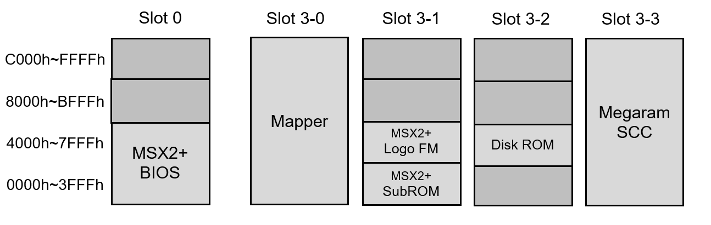

# MSXHeroTN

**An MSX2+ home computer, in an FPGA, on a Tang Nano 20K.**

It boots to its own file browser, runs your ROMs off an SD card, takes a real joystick, and
puts everything on HDMI. A USB keyboard plugs straight into the shield. Press `F12` at any
time — in the browser or mid-game — for settings.

This is a fork of [Papipapito/MSXnano](https://github.com/Papipapito/MSXnano), retargeted to
run on the **MiSTeryShield20k RPi Pico USB** — an open-hardware shield from the
[MiSTle](https://github.com/MiSTle-Dev) project — so that the shield's joystick port and MIDI
sockets are wired to something instead of sitting inert.

---

## It works

Everything here has been confirmed by hand on a real board, not by reading the code.

| | |
|---|---|
| Boots, browses the SD card, runs games | yes |
| DB9 joystick | yes — all directions, both fire buttons |
| USB keyboard and gamepad | yes, through the shield |
| HDMI video and audio | yes |
| `F12` settings overlay | yes |
| Turbo — 5.37 MHz, the real Panasonic WSX speed | yes |
| Scanlines, aspect, stereo, second SCC+, volume | yes |
| Reset and Cold Boot from the overlay | yes |
| **Remembering your settings** | **not yet** |
| MIDI | not yet — the sockets are there, the wiring isn't |
| WiFi | not on this fork |

**Settings are lost at power-off.** Volume and joystick port go back to defaults every time.
That is the one feature still being finished, and it is in progress on the `dev` branch.

---

## What it looks like

The browser starts before the OS, so you pick a game before there is an MSX to run it.


`F12` brings the overlay up over whatever is running.


---

## What you need

| Part | Notes |
|---|---|
| **Sipeed Tang Nano 20K** | the FPGA board |
| **MiSTeryShield20k RPi Pico USB** | required — it carries the USB port and the joystick socket. Open hardware from the [MiSTle](https://github.com/MiSTle-Dev) project: [KiCad sources](https://github.com/MiSTle-Dev/Boards/tree/main/misteryshield20k_rpipico) |
| **Raspberry Pi Pico** | sits on the shield and handles the keyboard |
| **microSD card** | FAT16 or FAT32, any size |
| **USB-C cable** | power, and programming the FPGA |
| **HDMI cable and a USB keyboard** | |
| DB9 joystick | optional — Atari/MSX style |

The full list, with the reasoning and the places upstream's own BOM is wrong, is in
[docs/BOM.md](docs/BOM.md).

Note that the Tang Nano 20K has **no USB-A socket**. The keyboard plugs into the *shield*. On
a bare Tang you would need a powered hub and an OTG adapter; the shield is what removes that.

---

## Getting it running

### 1. Flash the FPGA

> **Take the Tang out of the shield first.** With the shield attached, programming fails with
> `ftdi_usb_reset failed (-6)`. Out of the shield it works every time.

[`openFPGALoader`](https://github.com/trabucayre/openFPGALoader) runs on macOS, Linux and
Windows:

```sh
# the core
openFPGALoader -b tangnano20k -f compiled/msxnano-mistle_tangnano20k.fs

# the BIOS pack — only needed once
openFPGALoader -b tangnano20k --external-flash -o 0x200000 --file-type raw goauld_rom_int.bin
```

A prebuilt bitstream is in [`compiled/`](compiled/), so you do not need an FPGA toolchain
unless you want to change something.

### 2. Flash the Pico

Hold BOOTSEL, plug it into a computer, and drop `fpga_companion.uf2` — the `BOARD=PICO` build
from [FPGA-Companion](https://github.com/MiSTle-Dev/FPGA-Companion) — onto the `RPI-RP2` drive
that appears. Stock firmware; nothing custom is needed.

> Do **not** flash companion firmware onto the Tang's own BL616 chip. It replaces the
> programmer, and afterwards you cannot talk to the board at all. This fork does not use that
> chip for anything.

### 3. Fill the SD card

Copy `.rom` and `.dsk` files onto it, in folders if you like, and put it in the Tang.

Power up, and you should be looking at the browser.

---

## Using it

| Extension | Loaded as |
|---|---|
| `.rom` | cartridge, with the mapper detected automatically |
| `.dsk` | disk image, through Nextor |

Only those two. A `.mx2` file is byte-identical to a `.rom` but stays **invisible until you
rename it**, because the browser matches the three extension letters literally.

**In the browser:** arrows and RETURN navigate and launch, BS goes back, `R`/`D`/`A` filter by
type, TAB switches partition, `H` opens help, and ESC boots straight to MSX-DOS.

**`F12`** opens the settings overlay, in the browser or in a game.

A cartridge is loaded into slot 3-3. This is the layout the MSX sees:



---

## If something goes wrong

The last bitstream verified working on hardware is kept in
[`compiled/known-good/`](compiled/known-good/), where no later build can overwrite it. One
command puts you back:

```sh
openFPGALoader -b tangnano20k -f compiled/known-good/msxnano-mistle_tangnano20k_6389ac0.fs
```

The BIOS pack does not need reflashing. Details in
[that folder's README](compiled/known-good/README.md).

---

## Branches

**`main` is the one that works.** It only moves when a build has been confirmed running on a
real board — not merely when it compiles, and not merely when it meets timing.

**`dev`** is where the work happens: half-finished features, builds that failed, and the notes
that go with them. If you want a machine rather than a project, stay on `main`.

---

## Under the hood

The engineering detail lives in `docs/`, and it is written to be read rather than skimmed:

- **[docs/FINDINGS.md](docs/FINDINGS.md)** — everything established about the hardware, with
  the evidence for each claim: the shield's wiring, the Tang's board revisions, how MSX MIDI
  actually works, the companion's SPI protocol, and a table of upstream's documentation errors.
- **[docs/ROADMAP.md](docs/ROADMAP.md)** — what is planned, what was rejected, and why.
- **[docs/UTILISATION.md](docs/UTILISATION.md)** — resource and timing figures for every build,
  including the failures and what each one taught.
- **[docs/BOM.md](docs/BOM.md)** — the parts list.
- **[case/](case/)** — a 3D-printable enclosure inherited from upstream. It does **not** fit
  with the shield attached.

Building it yourself needs **Gowin EDA**, which has no macOS version. If you are curious how
full the chip is, the short answer is 88%, and that has shaped most of the decisions here.

---

## What came from upstream

The Z80, the V9958 video chip with HDMI output, dual PSG, SCC and SCC+, OPLL, the SD card with
Nextor 2.1.4 and the file browser are all MSXnano's, unchanged.

**ColecoVision and Sega SG-1000 support was removed upstream in v1.9** and is not here, though
upstream's README still advertises it. It is recoverable rather than lost — the code is one
commit back in history — and restoring it would also be the groundwork for other
Z80 + TMS9918 + SN76489 machines such as the Sord M5 or Memotech MTX. See
[docs/ROADMAP.md](docs/ROADMAP.md).

---

## Credits and licence

**GPLv3**, inherited from upstream. Fork maintained by
[terracide303](https://github.com/terracide303).

Development on this fork is done with AI assistance — **Claude** (Anthropic), via
[Claude Code](https://claude.com/claude-code). The retargeting, the RTL changes and this
documentation were written with Claude's help and reviewed before committing; those commits
carry a `Co-Authored-By: Claude` trailer, so `git log` shows exactly which ones.

- [Papipapito/MSXnano](https://github.com/Papipapito/MSXnano) — the core this forks
- [jabadiagm/MSXgoauldSD_tn20k](https://github.com/jabadiagm/MSXgoauldSD_tn20k) — MSXnano's own basis
- [MiSTle-Dev/FPGA-Companion](https://github.com/MiSTle-Dev/FPGA-Companion) — the Pico firmware
- [MiSTle-Dev/Boards](https://github.com/MiSTle-Dev/Boards) — the shield itself, as open KiCad
  hardware. This fork exists to make its connectors work
- [MiSTle-Dev/MiSTeryNano](https://github.com/MiSTle-Dev/MiSTeryNano) — where the shield's
  joystick pin assignment was read from, after getting it wrong twice
